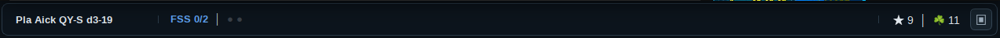
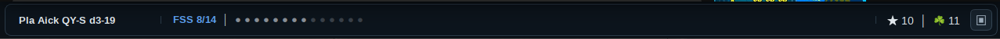
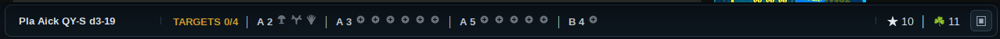
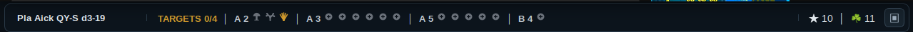
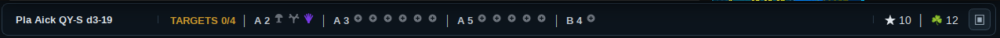
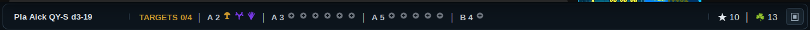
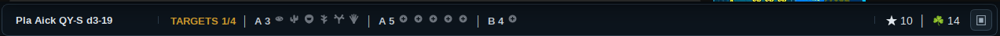
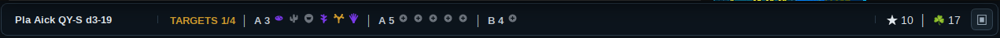
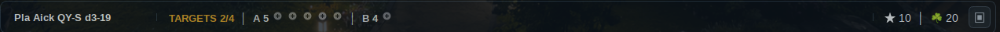
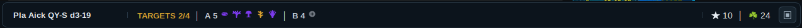

# Elite Journal Helper

A Linux-native **Elite Dangerous** exploration helper with a full dashboard and a compact Thin Mode designed to sit at the bottom of your screen.

 **toggle see through mode available**




The app watches Elite Dangerous journal logs, updates live as the game writes new events, and shows an always-on-top PyQt6 window with system, body, DSS, exobiology, and special-signal information.

This project was recently refactored from one large `ed_journal_probe.py` file into several smaller Python modules.

`ed_journal_probe.py` is now the main entry point, while journal handling, state tracking, helper rules, ship icon lookup, and the PyQt6 UI live in separate files.

```text
ed_journal_probe.py   main entry point
journal.py            journal path lookup, journal monitoring, and event handling
state.py              commander/system/body state models
rules.py              high-value world, bio, and special-candidate rules
search_targets.py     mining/search target definitions and match rules
ships.py              ship friendly names and icon lookup
ui.py                 PyQt6 dashboard window
styles/dashboard.qss  external runtime stylesheet
assets/               app icon and ship images
```

## Features

### Live Journal Monitoring

- Live monitors the newest Elite Dangerous `Journal*.log` file.
- Uses Linux file monitoring through `watchdog` / inotify.
- Displays the latest journal event.
- Tracks current system, body/location, ship/suit state, and travel status.

### Route Awareness

- Supports `NavRoute.json`.
- Shows system, target, and final destination route cards.
- Handles route progress while traveling.

### Mining Search Mode

- Adds a Search Type / Search Item selector in the top dashboard.
- Current search types:
  - None
  - Mining
  - Engineering placeholder
- Mining search can guide the commander toward useful ring targets.
- Tritium search currently checks for:
  - Gas giant
  - Icy ring
  - Confirmed Tritium hotspot signals from `SAASignalsFound`
- Search condition dots:
  - Red dot = condition not found yet
  - Blue dot = condition found while the overall target is still unconfirmed
  - Green title/dots = selected target fully confirmed, such as a Tritium hotspot
- Adds a `Special / Comments` table column for search results such as:
  - Possible Tritium prospect: scan icy ring
  - Confirmed Tritium hotspot x4

### System Body Tracking

- Displays stars, planets, belts, and discovered bodies in a table.
- Sorts important bodies toward the top.
- Tracks DSS mapping status.
- Highlights high-value DSS targets:
  - Earth-like worlds
  - Water worlds
  - Ammonia worlds
  - Terraformable high metal content worlds
  - Terraformable rocky bodies

### Exobiology Tracking

- Tracks biological signal counts.
- Tracks exobiology sampling progress.
- Uses colored Bio Progress pills:
  - Gray = expected organic, not found yet
  - Amber = found or sampling started
  - Strong violet with check mark = final `Analyse` / 3-of-3 completed
- Uses genus-specific biological silhouettes in thin mode and the full Bio Progress pills.

### Special Signal Detection

- Shows a special signal alert banner.
- Watches for notable signal keywords, including:
  - Guardian
  - Thargoid
  - Non-Human
  - Notable Stellar Phenomena
  - Listening Post
  - Unregistered signals
  - Ancient ruins / structures
  - Barnacles
  - Anomalies

### Exploration Notes

- Adds soft candidate notes for:
  - Guardian candidate bodies
  - Thargoid-interest ammonia bodies

### Desktop Dashboard UI

- Shows an always-on-top PyQt6 window.
- Includes a frameless Thin Mode that collapses downward while keeping its lower edge fixed.
- Thin Mode shows HONK, FSS, TARGETS, and COMPLETE stages without the full dashboard clutter.
- Completed target planets disappear from Thin Mode while target progress remains visible.
- The right side shows separate unsold exploration-system and exobiology-sample counters.
- Exploration and biological counters reset independently when their matching sale journal events occur.
- Supports ship icons from `assets/ships/`.
- Supports opacity / solid window toggle.
- Uses an external runtime stylesheet at `styles/dashboard.qss`.

## Install on Ubuntu / Kubuntu

Install the required packages:

```bash
sudo apt update
sudo apt install python3 python3-pyqt6 python3-watchdog
```

## Run

From the repo folder:

```bash
python3 ed_journal_probe.py --history-files 300
```

Or run with a full path:

```bash
python3 ~/Documents/src/elite-journal-helper/ed_journal_probe.py
```

Adjust the path if you cloned the repo somewhere else.

## Optional Alias

For Bash:

```bash
echo "alias edHelper='python3 ~/Documents/src/elite-journal-helper/ed_journal_probe.py'" >> ~/.bashrc
source ~/.bashrc
```

Then launch with:

```bash
edHelper
```

For Zsh:

```bash
echo "alias edHelper='python3 ~/Documents/src/elite-journal-helper/ed_journal_probe.py'" >> ~/.zshrc
source ~/.zshrc
```

## File layout

```text
ed_journal_probe.py   main entry point
state.py              BodyInfo and CommanderState data models
journal.py            journal path lookup, JournalMonitor, event handling
rules.py              high-value/bio/special-candidate helper rules
search_targets.py     mining/search target definitions and match rules
ships.py              ship friendly names and icon paths
ui.py                 PyQt6 OverlayWindow
styles/dashboard.qss  external UI stylesheet
assets/               icons and ship images
```

## Thin Mode

Use the small mode button in the lower-right corner of the full dashboard to enter Thin Mode.

### Thin Mode Progression

The screenshots below show Thin Mode progressing from system discovery through target identification and biological completion.
Pre-Honk

After Honk Proper number of planets shown

FSS scan planets get brigter

Scan complete any planets that require a detail scan and potention plants shown.

After detail scan icon for plant types shown


Plant scanning progress






All plants for a plant have been scan and removed, updated Target count.





Second planet complet, Target count updated.



Third planet complete

All planets complete


Thin Mode is designed to sit above a narrow monitor such as ThinMon. It removes the desktop title bar and presents only current exploration work:

```text
System | HONK / FSS / TARGETS / COMPLETE | remaining targets | ★ held exploration | ☘ held bio
```

Stages:

```text
HONK       waiting for the discovery scan
FSS        shows identified bodies versus total system bodies
TARGETS    shows only bodies that still need DSS or biological work
COMPLETE   no remaining work for the current system
```

Biological silhouettes represent the expected genus rather than using identical dots. Their colors show progress:

```text
Gray       expected, not started
Amber      sampling started
Violet     Analyse complete
```

The held-data counters are intentionally separate:

```text
★  exploration systems held until SellExplorationData
☘  completed biological samples held until SellOrganicData
```

These counters are stored through Qt settings and survive closing the application. SQLite history remains inactive.

## Customizing the UI

The main stylesheet is loaded at runtime from:

```text
styles/dashboard.qss
```

You can edit that file to change colors, borders, fonts, and card styling without changing Python code.

## Journal Folder

The app tries to auto-detect the Elite Dangerous journal folder.

Common Steam / Proton locations:

```text
~/.steam/debian-installation/steamapps/compatdata/359320/pfx/drive_c/users/steamuser/Saved Games/Frontier Developments/Elite Dangerous
```

```text
~/.local/share/Steam/steamapps/compatdata/359320/pfx/drive_c/users/steamuser/Saved Games/Frontier Developments/Elite Dangerous
```

You can also pass the journal folder manually:

```bash
python3 ed_journal_probe.py --journal-dir "/path/to/Elite Dangerous"
```

## UI Meaning

### Mapped

`Mapped` means **DSS probe mapping completed**, not merely FSS scanned, landed on, or exobiology-scanned.

- Green `Yes` = DSS complete.
- Orange/Yellow `No` = DSS not complete.
- Blank = not a DSS-mappable body, such as a star or belt cluster.

### Bio Status

The Bio Status column tracks exobiology separately from DSS mapping.

Pill colors:

```text
Gray      = expected genus, not found yet
Amber     = found / sampling started
Violet ✓  = final Analyse / 3-of-3 completed
```

Example progression:

```text
[Bacterium] [Fonticula] [Fungoida] [Osseus]
[Bacterium] [Fonticula] [• Fungoida] [Osseus]
[Bacterium] [Fonticula] [✓ Fungoida] [Osseus]
```

### Priority

The Priority column summarizes what matters most.

Examples:

```text
Water World - DSS NEEDED
Terraformable High metal content body - DSS NEEDED
Bio signals
Bio complete
Guardian candidate
Thargoid-interest ammonia body
```

### Search / Mining Rules

The search controls are meant to pull the commander toward a selected goal.

Example:

```text
Search Type: Mining
Search Item: Tritium

For Tritium, the app watches for:

Gas giant
Icy ring
Confirmed Tritium hotspot

The rule display uses simple status colors:

Red dot      = condition not found yet
Blue dot     = condition found, but the complete target is not yet confirmed
Green dot/title = selected item fully confirmed
A gas giant with an icy ring is treated as a possible Tritium prospect. A SAASignalsFound journal event containing Type: Tritium is treated as confirmed.
```

## Special Alerts

Special alerts are keyword-based. They are attention flags, not proof that something rare exists.

The app checks journal events such as:

```text
FSSSignalDiscovered
SAASignalsFound
CodexEntry
```

Keyword examples:

```text
guardian
thargoid
non-human
xeno
ancient
ruins
guardian structure
guardian beacon
thargoid structure
barnacle
notable stellar phenomena
lagrange
anomaly
unregistered
listening post
```

False positives can happen, so the keyword list may need tuning as more journal examples are seen.

## Guardian Candidate Heuristic

The app can mark a body as a possible Guardian-style candidate when it looks similar to known Guardian ruin body conditions:

```text
Landable
Rocky Body or High Metal Content Body
Surface temperature roughly 180-310 K
Radius roughly 1,000-3,000 km
```

This is only a soft clue.

## Thargoid Interest Heuristic

The app can mark ammonia-related bodies as Thargoid-interest candidates.

This is also only a soft clue. A hard alert should come from an actual journal signal, Codex entry, or FSS event containing wording such as:

```text
Thargoid
Non-Human
Barnacle
Probe
Sensor
```

## Current Limitations

- Module split is early and may still need cleanup.
- SQLite history storage is not active; Thin Mode held-data counters use Qt settings instead.
- No web dashboard yet.
- No iPhone/mobile dashboard yet.
- No EDSM/Inara/EDDN integration.
- Bio prediction is basic.
- Special alerts may need tuning.
- Old journal data may not always reconstruct all exobiology state perfectly, because some live state depends on the order and presence of journal events.
- Mining search currently focuses on ring/body journal data and Tritium-style hotspot detection.
- Engineering search is only a placeholder for now.

## Future Ideas

- Continue improving the module boundaries.
- Add a web server / browser dashboard.
- Add local SQLite history.
- Add a browser/iPhone dashboard.
- Add desktop notifications or sounds.
- Add flight-plan / route monitoring.
- Add better biological prediction.
- Add exportable exploration session reports.
- Add settings for colors, alerts, and keyword lists.
- Add more mining item rules.
- Add better ring/hotspot display.
- Add engineering material search.
- Add saved user search preferences.

## Disclaimer

This is an unofficial Elite Dangerous helper tool. It is not affiliated with Frontier Developments.

Notes

- This app reads local journal files only.
- No Frontier API login is used.
- Ring/mining search modes are planned for a later version.
