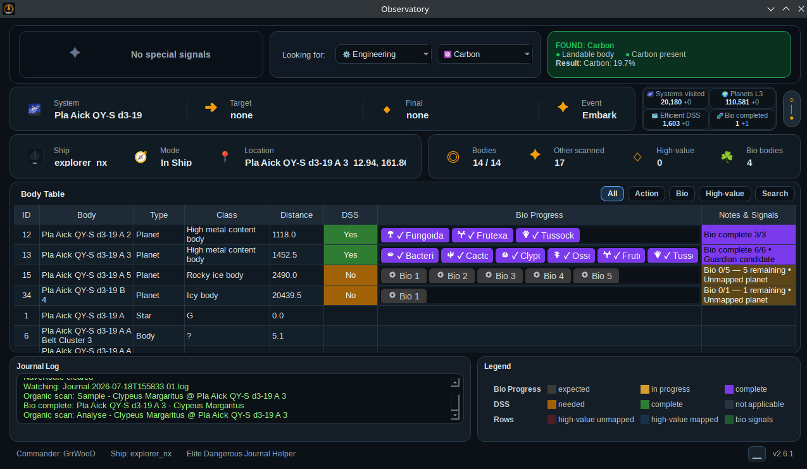
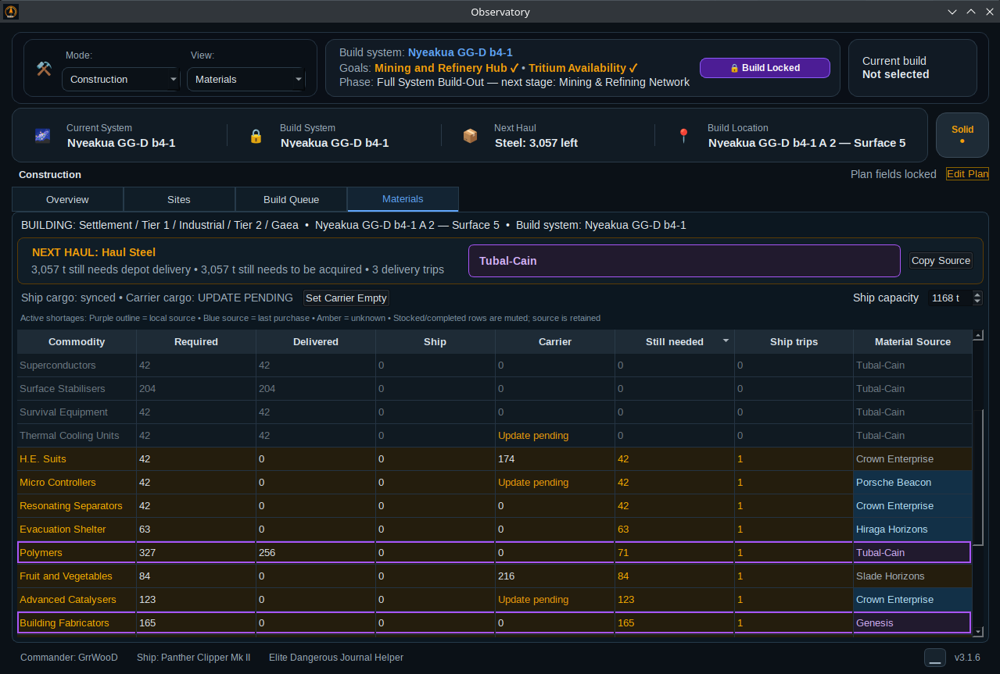

# Elite Journal Helper

**Elite Journal Helper** is a PyQt6 companion for **Elite Dangerous** that reads the game's journal in real time and turns it into a compact exploration and system-construction dashboard.

It is designed to stay useful beside the game rather than require a full-screen window. The normal dashboard provides detailed system and construction information, while Mini Mode keeps only the information you need during flight or hauling.



## Highlights

### Exploration

- Live Elite Dangerous journal monitoring.
- System, body, DSS, route, and exobiology tracking.
- High-value world and biological target identification.
- Mining/search target assistance.
- Special-signal alerts for Guardian, Thargoid, and other notable discoveries.
- Compact Mini Mode for use while flying.

### Construction

- Goal-driven colonisation build planning.
- Build Queue, Materials, and System Layout views.
- T2/T3 construction-point tracking and calibration.
- Journal-backed construction-history reconciliation.
- Ship and fleet-carrier material tracking.
- Material-source tracking and trip estimates.
- Mini Mode commodity tracking: right-click a material to pin it.
- Mini Mode `STOCK` total for the pinned commodity across ship + carrier.
- Responsive Construction Overview for narrower windows.



## Quick start

### Linux

Install the runtime dependencies:

```bash
sudo apt update
sudo apt install python3 python3-pyqt6 python3-watchdog
```

Run from the repository root:

```bash
python3 ed_journal_probe.py
```

To inspect startup performance when troubleshooting:

```bash
python3 ed_journal_probe.py --profile-startup
```

### Windows

Python-based Windows installation is supported through the installer in `scripts/`.
See [docs/INSTALLING.md](docs/INSTALLING.md) for Linux desktop integration and Windows instructions.

## Repository layout

The repository keeps **one compatibility launcher** at the root so existing shortcuts continue to work. Application code lives under `src/elite_journal_helper/`.

```text
Elite-Dangerous-Helper/
├── README.md
├── CHANGELOG.md
├── requirements.txt
├── ed_journal_probe.py            # stable compatibility launcher
├── src/
│   └── elite_journal_helper/
│       ├── app.py                 # CLI/startup wiring
│       ├── journal.py             # journal monitoring/event handling
│       ├── state.py               # commander/system/body state
│       ├── ui.py                  # main dashboard and Mini Mode
│       ├── construction_ui.py     # Construction Mode UI/workflow
│       ├── construction_rules.py  # facility catalog/build rules
│       ├── rules.py               # exploration rules
│       ├── search_targets.py      # mining/search definitions
│       ├── ships.py               # ship names/icon lookup
│       ├── bio_icons.py           # exobiology icon helpers
│       ├── paths.py               # stable resource locations
│       └── version.py             # single release-version source
├── assets/                        # screenshots, icons, ship art
├── data/                          # colonisation data
├── styles/                        # Qt stylesheet
├── tests/                         # automated tests
├── docs/                          # installation/development/release/reference docs
├── scripts/                       # install, uninstall, and release helpers
└── tools/                         # developer data utilities
```

This layout keeps the repository root readable without breaking users who already launch `ed_journal_probe.py` directly.

## Development

Create a virtual environment if desired and install development dependencies:

```bash
python3 -m venv .venv
source .venv/bin/activate
python -m pip install -r requirements-dev.txt
```

Run the test suite:

```bash
python -m pytest -q
```

Run the release sanity checks:

```bash
./scripts/check-release.sh
```

## Releases

Release history is maintained in [CHANGELOG.md](CHANGELOG.md). The release process is documented in [docs/RELEASING.md](docs/RELEASING.md).

## Notes

Elite Journal Helper reads local Elite Dangerous journal and JSON files. It does not need to modify the game files.

The root `ed_journal_probe.py` filename is intentionally retained for shortcut compatibility. Runtime implementation modules now live under `src/elite_journal_helper/`.
